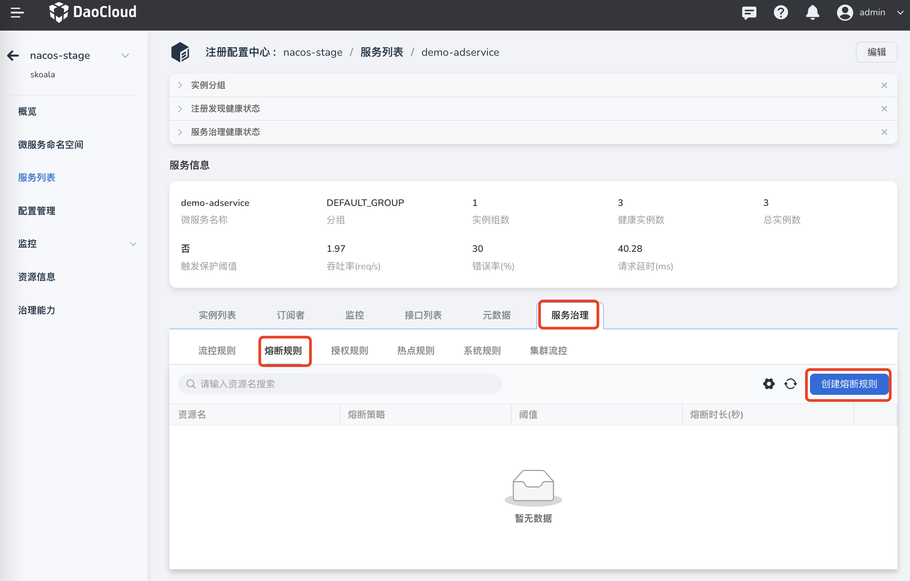
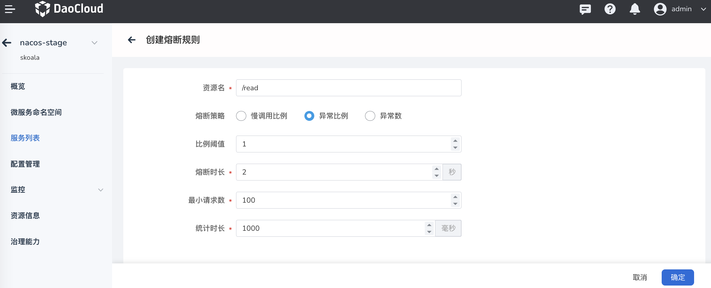
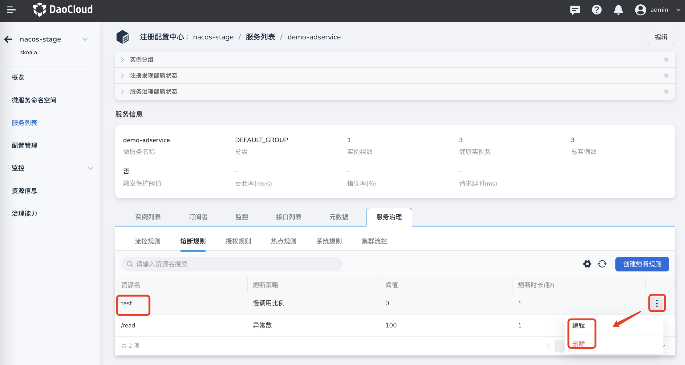

---
hide:
  -toc
---

# 创建熔断规则

熔断规则可以监控应用内部或者下游服务的响应时间或异常比例。当达到指定的阈值时降低下游依赖的优先级，并且在指定的时间范围内不会调用优先级低的不稳定资源，避免应用受到影响，从而保障应用高可用性。一个熔断时长结束后，熔断器进入探测恢复状态：如果接下来的一个请求的响应时间小于所设定的慢调用最大响应时间，则结束熔断，否则该资源会被再次被熔断。

创建熔断规则的方式如下：

1. 点击目标托管注册中心的名称，然后在左侧导航栏点击`微服务列表`，在最右侧点击更多按钮选择`治理`。

    > 注意：微服务在`是否可以治理`一栏应该显示为`是`，才能进行后续步骤。

    

2. 选择`熔断规则`，然后在右侧点击`创建熔断规则`。

    

3. 参考下列说明填写规则配置，并在右下角点击`确定`。

    - 资源名：需要控制哪个资源的流量就填写哪个资源的名称，例如当前服务下的某个 API 接口、函数、变量等。
    - 慢调用比例：如果在一个单位统计时长内，如果慢调用比例大于所设定的比例阈值，则在该熔断时长内的剩余时间里，对资源进行熔断。
    - 异常比例：在单位统计时长内，如果异常请求的比例大于阈值，则在剩余时间内对资源进行熔断。
    - 异常数：在单位统计时长内，如果收到的异常请求数达到所设定的阈值，则在剩余时间内对资源进行熔断。
    - 最大 RT：请求的最大响应时间，单位为毫秒，**响应时间超过此值的请求被视为慢调用请求**。
    - 比例阈值：在一个统计时长内，慢调用请求（适用于慢调用比例策略）/异常请求（适用于异常比例策略）在所有请求中占的比例。阈值范围是 [0.0, 1.0]，代表 0% - 100%。
    - 熔断时长：熔断持续的时间，单位为秒。在熔断时长内，所有的请求都会快速失败。
    - 最小请求数：在一个统计时长内，触发熔断的最小请求数。**若当前统计时长内的请求数小于此值，即使达到熔断条件也不会触发熔断**。
    - 统计时长：统计的时间窗口长度，单位为毫秒，取值范围为 1 秒 —— 120 分钟。

        

4. 创建完成后可以在熔断规则列表中查看新建的规则。在右侧点击更多按钮可以更新规则或者删除该规则。

    
