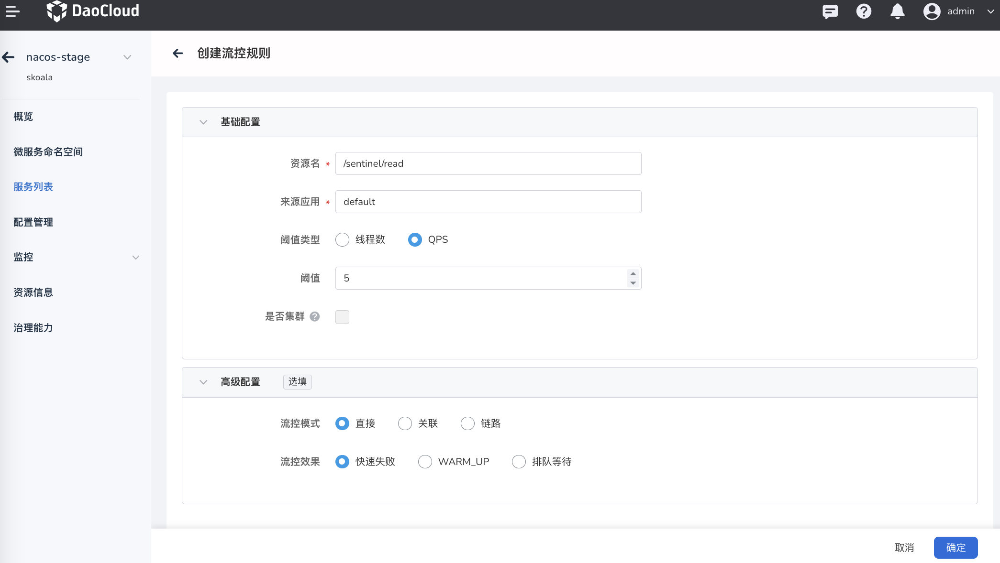

---
hide:
  -toc
---

# 创建流控规则

流控规则的原理是监控应用或服务流量的 QPS 指标，当指标达到阈值时根据预先设定的规则对请求流量进行控制，防止应用因短时间内无法处理过多流量而崩溃。使用流控规则后，系统可以在接下来的空闲期间逐渐处理堆积的请求，当指标重新恢复到阈值以下后，恢复正常的流量请求控制。

创建流控规则的方式如下：

1. 点击目标托管注册中心的名称，然后在左侧导航栏点击`微服务列表`，在最右侧点击更多按钮选择`治理`。

    > 注意需要治理的微服务在`是否可以治理`一栏应该显示为`是`，才能进行后续步骤。

    

2. 选择`流控规则`，然后在右侧点击`创建流控规则`。

    

3. 参考下列说明填写规则配置，并在右下角点击`确定`。

    - 资源名：需要控制哪个资源的流量就填写哪个资源的名称。
    - 来源应用：Sentinel 可以针对调用者进行限流，只有当请求来自特定的调用者时才启用流控规则，来自其他调用者的请求不受此流控规则的约束。默认为 `default`，表示不区分来源，限制所有的调用者发来的请求。
    - 阈值类型——QPS：QPS 指每秒钟的请求数量。当资源每秒内响应的请求达到所设置的阈值时，启用流控规则开始限制服务接收的请求。
    - 阈值类型——线程数：调用该接口的线程数达到一定阈值时进行限流。
    - 是否集群：是否将所设置的规则应用于服务所在的集群范围。
    - 流控模式——直接：直接对上方`资源名`字段填写的资源进行流量控制。
    - 流控模式——关联：判断上方`资源名`字段填写的资源和关联资源的优先级，**对优先级较低的资源实施限流**。
    - 流控模式——链路：根据调用链路入口限流，只限制指定链路上的流量。入口资源即该调用链路入口的上下文名称。
    - 流控效果——快速失败：当资源响应的请求达到所设置的阈值时，直接拒绝后续的调用请求。阈值类型必须需设成 QPS，否则无效。
    - 流控效果——WARM_UP：在设定的预热时间内逐渐将 QPS 增加到设定的阈值，之后一直维持在该阈值。阈值类型必须需设成 QPS，否则无效。这样可以缓慢增加通过的流量，逐渐预热系统，防止空闲系统突然涌入大量流量而被压垮。
    - 流控效果——排队等待：QPS 超过阈值时后续请求排队等待响应，超过所设定的超时时间（单位：毫秒）后请求失败。阈值类型必须需设成 QPS，否则无效。适用于处理间隔性突发流量，在某一秒有大量请求涌入，而接下来的几秒则处于空闲状态，例如消息队列。

        

4. 创建完成后可以在流控规则列表中查看新建的规则。在右侧点击更多按钮可以编辑更新规则或者删除该规则。

    
