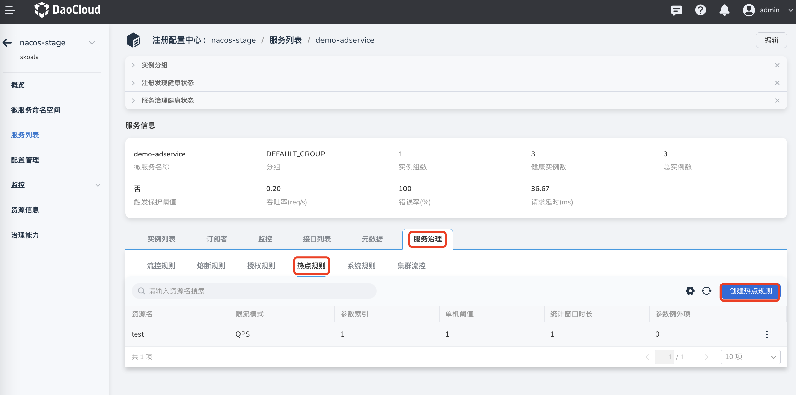
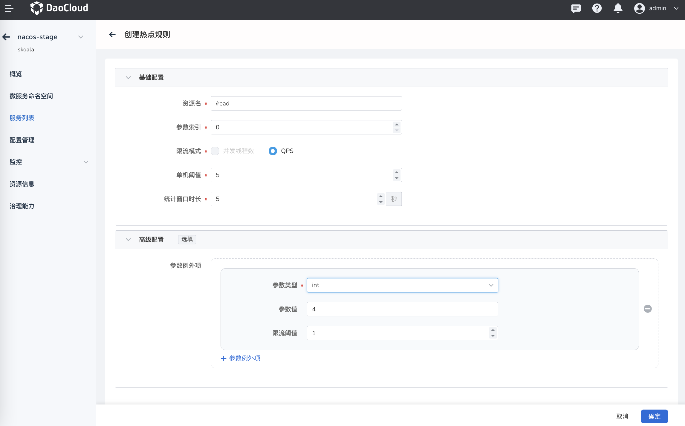
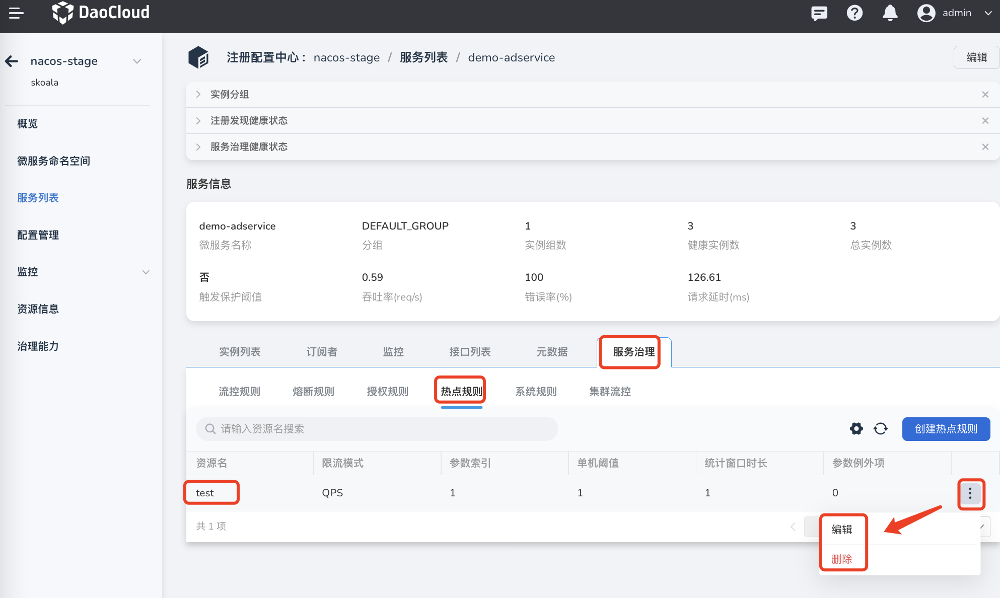

---
hide:
  -toc
---

# 创建热点规则

热点即经常被访问的数据。热点规则适用于对高频访问的资源进行流量控制，防止短时间内流量过大影响系统稳定性。例如，在以下场景中需要统计某个热点数据中访问频次最高的数据，并对其流量控制。

- 针对一段时间内最频繁购买的商品 ID 进行限制，防止击穿缓存而导致大量请求到数据库的情形。
- 针对一段时间内频繁访问的用户 ID 进行限制，防止恶意刷单。

**在 DCE 5.0 中，触发热点规则后的流控效果是直接失败，即达到设定的阈值时，对资源的后续请求会直接失败，而不是排队等待。**

创建热点规则的方式如下：

1. 点击目标托管注册中心的名称，然后在左侧导航栏点击`微服务列表`，在最右侧点击更多按钮选择`治理`。

    > 注意需要治理的微服务在`是否可以治理`一栏应该显示为`是`，才能进行后续步骤。

    

2. 选择`热点规则`，然后在右侧点击`创建热点规则`。

    

3. 参考下列说明填写规则配置，并在右下角点击`确定`。

    - 资源名：需要控制哪个资源的流量就填写哪个资源的名称，例如当前服务下的某个 API 接口、函数、变量等。
    - 参数索引：热点参数的索引位置，对应 `WithArgs(args ...interface{})` 中的参数索引位置，从 0 开始。
    - 限流模式：选择基于调用资源的线程数或者 QPS 进行流量控制。
    - 单机阈值：作用于每个热点参数的阈值，例如 QPS 达到多少时就开始对热点参数进行流量控制。
    - 统计窗口时长：线程数或者 QPS 的统计周期，例如统计窗口时长为 10s 且 QPS 阈值为 5 时，表示 10s 内对每个热点参数的访问不超过 5 次。
    - 参数例外项：当某个参数值单独设置阈值，不受上方`单机限阈`值的限制。

        

4. 创建完成后可以在热点规则列表中查看新建的规则。在右侧点击更多按钮可以更新规则或者删除该规则。

    
