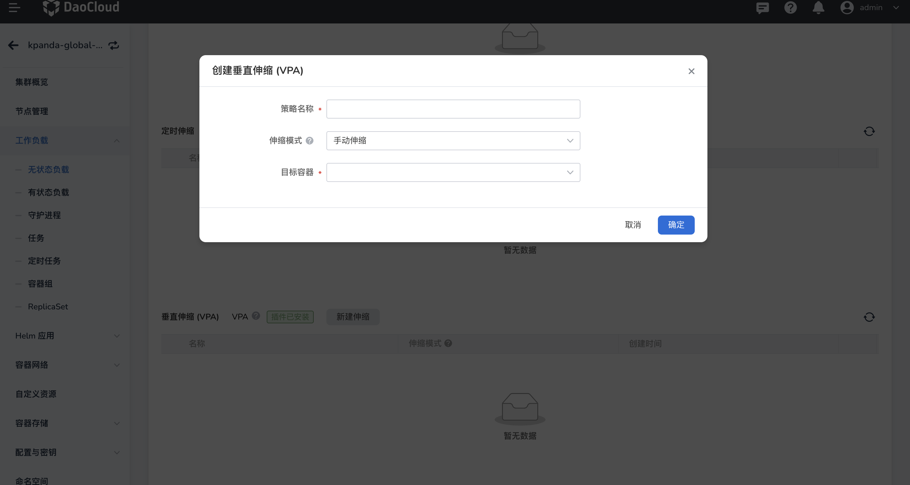

# 垂直伸缩（VPA）

DaoCloud Enterprise 5.0 支持基于容器资源使用情况动态调整 Pod 的请求值的容器垂直扩缩容策略（Vertical Pod Autoscaler, VPA）。
VPA 是通过监控一段时间内 Pod 的资源申请和用量，来计算 Pod 最为适合的 CPU 和内存的请求值。
通过使用 VPA，能够让集群下的每个 Pod 的资源配置值更加合理，从而提高集群的整体资源利用率，避免集群资源浪费。
在第五代产品中，我们支持了手动和自动两种方式来修改资源请求值，您可以根据实际需要进行配置。

本文将介绍如何为工作负载配置 Pod 垂直伸缩。

!!! note

    1. 使用 VPA 前，请确保当前集群已完成 `metrics-server` 和 `VPA` 插件的安装。
    2. 使用 VPA 修改 Pod 的资源请求将会触发 Pod 重启，由于 Kubernetes 本身的限制， Pod 重启后，将可能会调度到其它节点上。

### 前提条件

在为工作负载配置垂直伸缩策略之前，需要满足以下前提条件：

- 容器管理模块[已接入 Kubernetes 集群](../Clusters/JoinACluster.md)或者[已创建 Kubernetes 集群](../Clusters/CreateCluster.md)，且能够访问集群的 UI 界面。

- 已完成一个[命名空间的创建](../Namespaces/createns.md)、[无状态工作负载的创建](../Workloads/CreateDeploymentByImage.md)或[有状态工作负载的创建](../Workloads/CreateStatefulSetByImage.md)。

- 当前操作用户应具有 [`NS Edit`](../Permissions/PermissionBrief.md#ns-edit) 或更高权限，详情可参考[命名空间授权](../Namespaces/createns.md)。

- 已完成[`metrics-server 插件`](Install-metrics-server.md)、[`VPA 插件`](Install-vpa.md)的安装。

### 操作步骤

参考以下步骤，为工作负载配置内置指标弹性伸缩策略。

1. 点击左侧导航栏上的`集群列表`进入集群列表页面。点击一个集群名称，进入`集群详情`页面。

    

2. 在集群详情页面，点击左侧导航栏的`工作负载`进入工作负载列表后，点击一个负载名称，进入`工作负载详情`页面。

    

3. 点击`弹性伸缩`页签，查看当前集群的弹性伸缩配置情况。

    

4. 确认集群已[安装了 `metrics-server`](Install-metrics-server.md) 和 [`VPA`](Install-vpa.md)，且插件运行状态为正常后，即可点击`新建伸缩`按钮。

    

5. 编辑 VPA 垂直伸缩策略参数。

    - 策略名称：输入垂直伸缩策略的名称，请注意名称最长 63 个字符，只能包含小写字母、数字及分隔符（“-”），且必须以小写字母或数字开头及结尾，例如 vpa-my-dep。
    - 伸缩模式：执行修改 CPU 和内存请求值的方式，目前垂直伸缩支持手动和自动两种伸缩模式。
        - 手动伸缩：垂直伸缩策略计算出推荐的资源配置值后，需用户手动修改应用的资源配额。
        - 自动伸缩：垂直伸缩策略自动计算和修改应用的资源配额。
    - 目标容器：选择需要进行垂直伸缩的容器。

6. 完成参数配置后，点击`确定`按钮，自动返回弹性伸缩详情页面。点击列表右侧的 `⋮`，可以执行编辑、删除操作。

    